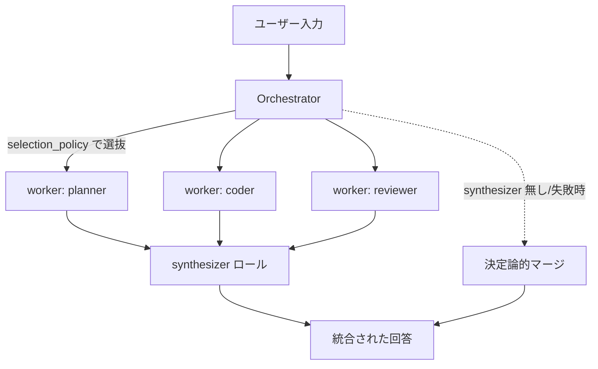

# Thug-Fugu Local LLM Orchestration


Thug AI の Fugu のように、複数ロールのローカル LLM を協調実行するための最小 Python 実装です。

> **English:** A minimal, standard-library-only Python toolkit for orchestrating **multiple local LLM roles** (planner / coder / reviewer / synthesizer) in parallel. It talks to **Ollama** and **OpenAI-compatible servers** (LM Studio, llama.cpp server, vLLM, …), merges the roles into a single answer, and exposes an **OpenAI Chat Completions–compatible local HTTP API** plus an **MCP consult tool** (`consult_thug_fugu`) for agents such as Claude Code. Local-first and experimental — no external proprietary API required.

**Status:** Local-first experimental. Built-in HTTP server はローカル開発 / private network 用であり、公開インターネット向けの hardened API server ではありません。外部公開する場合は reverse proxy 側で TLS、認証、rate limit、request size limit を設定してください。

標準ライブラリだけで動き、**Ollama** と **OpenAI 互換サーバー**（LM Studio、llama.cpp server、vLLM など）をバックエンドとして扱えます。planner / coder / reviewer などの複数ロールを並列実行し、synthesizer ロールが 1 つの回答に統合します。

- 設計仕様: [docs/design/local-llm-orchestration.md](docs/design/local-llm-orchestration.md)
- 分散構成（拡張）: [docs/design/distributed-inference.md](docs/design/distributed-inference.md)
- 運用セキュリティ: [docs/operations/security-profile.md](docs/operations/security-profile.md)
- OpenAI 互換範囲: [docs/reference/openai-compatibility.md](docs/reference/openai-compatibility.md)
- usage accounting 方針: [docs/reference/usage-accounting.md](docs/reference/usage-accounting.md)
- セキュリティポリシー: [SECURITY.md](SECURITY.md)

> 補足：Thug-Fugu は **Sakana AI の Fugu にインスピレーションを受けた、複数ロール協調実行の独立実装**です。Sakana AI / Fugu とは提携・互換を主張するものではなく、外部の proprietary Fugu API に依存せず、ローカル backend（Ollama / OpenAI 互換 / echo）だけで動きます。

---

## リポジトリ概要 / Repository overview

**日本語（About 用の短い説明）**
> 複数ロールのローカル LLM（planner / coder / reviewer / synthesizer）を並列に協調実行する最小 Python 実装。Ollama と OpenAI 互換サーバーに対応し、OpenAI Chat Completions 互換のローカル HTTP API と Claude Code 向け MCP ツールを備えます。標準ライブラリのみ・ローカルファースト。

**English (short "About" description)**
> Multi-role local LLM orchestration in pure Python — run planner / coder / reviewer / synthesizer roles in parallel over Ollama and OpenAI-compatible backends, with an OpenAI-compatible local HTTP API and an MCP consult tool for Claude Code. Standard-library only, local-first.

**推奨トピック / Suggested GitHub topics**

`llm` · `local-llm` · `llm-orchestration` · `multi-agent` · `ollama` · `openai-compatible` · `mcp` · `claude-code` · `ai-agents` · `self-hosted` · `inference` · `python`

> これらの About 文とトピックは、リポジトリ管理者が GitHub の **Settings → General → About**（説明・トピック欄）に貼り付けて公開設定できます。同じメタデータは機械可読な形で `pyproject.toml` の `description` / `keywords` / `classifiers` / `[project.urls]` にも定義しています。
> The About text and topics above can be pasted by a repository admin into GitHub's **Settings → General → About** (description and topics). The same metadata is defined in machine-readable form in `pyproject.toml` (`description`, `keywords`, `classifiers`, `[project.urls]`).

---

## できること

- JSON 設定でローカル LLM とロールを宣言的に定義
- 複数ロール（planner / coder / reviewer / synthesizer など）の並列実行
- synthesizer ロールによる回答統合（無い場合は決定論的マージにフォールバック）
- お題に応じたロール選抜（`all` / `keyword`）と適応コーディネーター（`direct` / `role_split` / `parallel_ensemble`）
- request deadline による総レイテンシ制御と部分結果フォールバック
- モデルプールによる round-robin / least-busy ルーティングと失敗時フェイルオーバー
- OpenAI Chat Completions 互換のローカル HTTP API（JSON 応答 + direct / role_split synthesizer の true token streaming + buffered SSE fallback）
- tool calling（HTTP / `consult()` / MCP で allow-listed ローカル tool 実行に対応。HTTP は明示 `tool_calls` 入力の実行から対応）
- Claude Code / MCP から呼べる consultant tool（`consult_thug_fugu`）
- CLI からの単発実行（`run`）と評価ハーネス
- 実 LLM なしで動く `echo` backend によるテスト

---

## アーキテクチャ



- worker ロール（`is_synthesizer: false`）は **並列実行**される（`ThreadPoolExecutor`、最大 `max_parallel_workers`）。各ロールは独立で、1 つが失敗しても他は続行する。
- `is_synthesizer: true` のロールが **統合**を担う。複数あれば先頭の 1 つが使われる。
- synthesizer が無い、または統合中に例外が出た場合は、worker 出力を**決定論的にマージ**して返す（`synthesis_error` に理由を記録）。
- worker が**全滅**した場合のみエラー（`OrchestrationError`）。

---

## クイックスタート

### 1. 設定確認

```bash
python3 -m fugu_local validate-config --config examples/fugu-local.echo.json
# => OK: 2 model(s), 4 role(s), selection_policy=keyword
```

### 2. 単発実行

```bash
PYTHONPATH=src python3 -m fugu_local run \
  --config examples/fugu-local.echo.json \
  "ローカルLLMのオーケストレーション設計をレビューして"
```

インストール後は `fugu-local run --config ... "質問"` でも実行できます。

`--json` を付けると、回答に加えて usage・verification・worker などのメタデータを JSON で受け取れます（エージェントから呼ぶとき向け）。

```bash
PYTHONPATH=src python3 -m fugu_local run --json \
  --config examples/fugu-local.echo.json \
  "設計をレビューして"
```

### 3. HTTP サーバー（OpenAI Chat Completions 互換）

```bash
PYTHONPATH=src python3 -m fugu_local serve \
  --config examples/fugu-local.ollama.json --host 127.0.0.1 --port 8080 \
  --max-concurrent-requests 8   # 同時処理の上限。超過時は HTTP 429。/health に現在の上限を表示

curl -s http://127.0.0.1:8080/v1/chat/completions \
  -H 'content-type: application/json' \
  -d '{"model":"fugu-local","messages":[{"role":"user","content":"実装計画を作って"}],"temperature":0.2}'
```

同時処理の上限を超えたリクエストは既定で即 HTTP 429 になります。任意で bounded queue を有効にすると、空きスロットができるまで `server.queue.timeout_seconds` の範囲で待機してから 429 を返せます（既定は無効）。

```json
{
  "server": {
    "queue": {"enabled": true, "max_size": 16, "timeout_seconds": 30}
  }
}
```

キューが満杯の場合や待機がタイムアウトした場合は 429 を返します。現在のキュー長は `/health` の `queue` に表示されます。

---

## 設定リファレンス

設定は 1 つの JSON で、必須の `models` / `roles` と、任意の `orchestrator` / `model_pools` / `coordinator` / `tool_calling` からなります。

### `models[]`

| フィールド | 型 | 必須 | 既定 | 説明 |
|---|---|---|---|---|
| `name` | string | ✅ | — | モデルの参照名（roles から参照。一意） |
| `backend` | string | ✅ | — | `ollama` / `openai-compatible` / `echo` |
| `model` | string | ✅ | — | バックエンド側のモデル名（例 `llama3.1`, `gpt-oss:120b`） |
| `base_url` | string | △ | `null` | エンドポイント URL。`ollama` / `openai-compatible` では **必須** |
| `api_key` | string | — | `null` | `openai-compatible` 用。`${ENV_VAR}` は環境変数に展開される |
| `timeout_seconds` | number | — | `120.0` | 1 リクエストのタイムアウト（> 0） |

### `roles[]`

| フィールド | 型 | 必須 | 既定 | 説明 |
|---|---|---|---|---|
| `name` | string | ✅ | — | ロール名（一意） |
| `model` | string | ✅ | — | 使う `models[].name`（存在しないとエラー） |
| `system_prompt` | string | — | `""` | そのロールの役割定義 |
| `keywords` | string[] | — | `[]` | `keyword` ポリシー時の選抜キーワード |
| `always_include` | bool | — | `false` | キーワードに関係なく常に選抜 |
| `is_synthesizer` | bool | — | `false` | 統合担当にする（worker からは除外される） |
| `is_verifier` | bool | — | `false` | verifier retry loop の検証担当にする（worker からは除外される） |

### `orchestrator`

| フィールド | 型 | 既定 | 説明 |
|---|---|---|---|
| `selection_policy` | string | `"all"` | `all` または `keyword` |
| `max_parallel_workers` | int | `4` | 並列ワーカー数の上限（> 0） |
| `temperature` | number | `0.2` | 生成温度 |
| `max_tokens` | int? | `null` | 生成トークン上限（指定時は > 0） |
| `request_timeout_seconds` | number? | `null` | リクエスト全体のデッドライン秒（指定時は > 0）。各ロールの `timeout_seconds` とは別軸 |

### 任意ブロック

| ブロック | 用途 | サンプル / 詳細 |
|---|---|---|
| `model_pools[]` | 複数 endpoint を 1 つの論理モデル名に束ね、round-robin / least-busy と失敗時フェイルオーバーを使う | `examples/fugu-local.model-pool.json` |
| `coordinator` | 軽量 triage で `direct` / `role_split` / `parallel_ensemble` を選ぶ | `examples/fugu-local.coordinator.json`, [Fugu-style coordinator spec](docs/design/fugu-style-coordinator-spec.md) |
| `tool_calling` | OpenAI tool schema の検証と allow-listed ローカル tool 実行。HTTP は明示 `tool_calls` 入力、`consult()` / MCP は `tool_calls` 引数に対応 | `examples/fugu-local.tool-calling.json`, [tool calling design](docs/design/tool-calling-support.md) |

### selection_policy の挙動

- **`all`**（既定）：synthesizer 以外の全 worker ロールを実行。
- **`keyword`**：`always_include` のロール＋**最新のユーザーメッセージ**に `keywords` のいずれかが（大文字小文字を無視して）含まれるロールを実行（過去の assistant / system メッセージは選抜に影響しない）。**1 つも一致しなければ先頭の worker ロールにフォールバック**する。

### request_timeout_seconds（リクエストデッドライン）

- `orchestrator.request_timeout_seconds` を指定すると、**リクエスト全体の上限時間**を設けます。各ロールの `timeout_seconds`（バックエンド単位）とは別軸で、user から見た総レイテンシを制御します。
- デッドライン到達時は未完了の worker を待たずに打ち切り、`WorkerResult.timed_out=true`・`error` 付きで結果に残します（バックグラウンドの呼び出しは各自の `timeout_seconds` で終了）。
- **1 つでも成功していれば**、その時点の出力で合成（または決定論マージ）して返します。デッドラインを過ぎている場合は synthesizer 呼び出しをスキップして即時にマージします。
- **全 worker がデッドラインに間に合わなければ** `OrchestrationError` を送出します。
- 未指定（既定）なら従来どおりデッドラインなしで全 worker を待ちます。

### バリデーション

models / roles が各 1 件以上、名前が一意、`backend` がサポート対象、`timeout_seconds` > 0、`ollama`/`openai-compatible` は `base_url` 必須、`roles[].model` が `models[].name` または `model_pools[].name` と一致、`selection_policy` がサポート対象、`max_parallel_workers` > 0、`max_tokens`（指定時）> 0、`request_timeout_seconds`（指定時）> 0。違反は `ConfigError`。

---

## 手元のモデルに差し替える

`examples/fugu-local.ollama.json` は `llama3.1` / `qwen2.5-coder` を例にしています。手元の Ollama にあるモデル名へ `models[].model` を変えるだけで動きます。

例：`gpt-oss:120b`（高精度ロール）と `gpt-oss:20b`（高速ロール）を使う（`examples/fugu-local.gpt-oss.json`）。

```json
{
  "models": [
    { "name": "oss-120b", "backend": "ollama", "model": "gpt-oss:120b", "base_url": "http://localhost:11434", "timeout_seconds": 300 },
    { "name": "oss-20b",  "backend": "ollama", "model": "gpt-oss:20b",  "base_url": "http://localhost:11434", "timeout_seconds": 300 }
  ],
  "roles": [
    { "name": "planner",     "model": "oss-120b", "system_prompt": "計画担当。タスクを分解しリスクを挙げる。", "keywords": ["設計","plan"], "always_include": true },
    { "name": "coder",       "model": "oss-20b",  "system_prompt": "実装担当。具体的な手順を出す。", "keywords": ["実装","code"] },
    { "name": "reviewer",    "model": "oss-120b", "system_prompt": "レビュアー。正しさ・安全・運用リスクを点検。", "keywords": ["レビュー","risk"] },
    { "name": "synthesizer", "model": "oss-120b", "system_prompt": "worker 出力を 1 つの簡潔な回答に統合。", "is_synthesizer": true }
  ],
  "orchestrator": { "selection_policy": "keyword", "max_parallel_workers": 4, "temperature": 0.2 }
}
```

OpenAI 互換サーバー（LM Studio / vLLM 等）を使う場合は `backend: "openai-compatible"`、`base_url`、必要なら `api_key: "${OPENAI_API_KEY}"`（環境変数展開）を指定します。

---

## バックエンド

| backend | 用途 | 必須 |
|---|---|---|
| `ollama` | ローカル Ollama サーバー | `base_url`（例 `http://localhost:11434`） |
| `openai-compatible` | LM Studio / llama.cpp server / vLLM 等の OpenAI 互換 API | `base_url`、必要に応じ `api_key` |
| `echo` | 実 LLM を呼ばず入力をそのまま返す。テスト・配線確認用 | なし |

---

## パフォーマンス特性

- worker は並列に投げられますが、単一GPUでは実効並列度はバックエンド実装・モデルサイズ・`OLLAMA_NUM_PARALLEL` に依存します。`max_parallel_workers` は「Thug-Fugu から同時に投げる上限」であり、GPU処理が線形に速くなる保証ではありません。
- 参考実測：`gpt-oss:120b` を 3 ロール＋`gpt-oss:20b` を 1 ロール、単一 GPU で約 **2 分 38 秒 / 1 回**。
- 速くしたい場合：ロール数を絞る、軽いモデルを混ぜる、`max_tokens` を抑える、`temperature` を下げる。単一GPU(GX10/MBP)での並列ロールや複数GPUの静的割当は [role/model assignment](docs/operations/multi-gpu-role-assignment.md)、複数ノードへ水平分散する場合は [distributed-inference.md](docs/design/distributed-inference.md) を参照。
- 1 つの config から必要なローカルサーバ群（ポート/モデル）を導出して起動コマンドを出すには `scripts/serve_local_models.py --config <config>` を使う（既定は表示のみ）。
- MBP（Apple M4 Max）+ `qwen2.5:0.5b` の実測では `OLLAMA_NUM_PARALLEL=2` が最良平均（1.54x vs `=1`）でした。まず `=2` から試し、モデル/プロンプトごとに測ってください。

---

## モデルプール / フェイルオーバー / ロードバランス

`model_pools[]` を使うと、1つの論理モデル名を複数エンドポイント（別ポート/別ノード）に束ね、role から参照できます。既存 `models[]` のみの設定はそのまま動きます（後方互換）。

```json
{
  "model_pools": [
    {
      "name": "fast-pool",
      "backend": "ollama",
      "model": "gpt-oss:20b",
      "endpoints": ["http://127.0.0.1:11434", "http://127.0.0.1:11435"],
      "policy": "least_busy",
      "cooldown_seconds": 30,
      "health": {
        "enabled": true,
        "interval_seconds": 30,
        "timeout_seconds": 2,
        "failure_threshold": 2,
        "success_threshold": 1,
        "require_model": false
      }
    }
  ],
  "roles": [
    {"name": "thinker", "model": "fast-pool", "always_include": true}
  ]
}
```

- `policy`: `round_robin`（呼び出しごとに先頭メンバーをローテーション）または `least_busy`（同時実行中の最も少ないメンバーを優先）。
- **フェイルオーバー**: あるメンバーが失敗したら同プールの次メンバーへ再試行。全メンバー失敗で初めてそのロールが失敗扱いになる。
- **受動ヘルスチェック（サーキットブレーカ）**: `cooldown_seconds` を指定すると、失敗したメンバーを一定時間だけ選抜の後ろへ回す（デプライオリティ化）。成功で即回復。全メンバーが cooldown 中でも除外はせず必ず試行するため、単一エンドポイントや全滅時も従来通り動く。既定 `0` は無効（後方互換）。
- **能動ヘルスチェック**: `health.enabled=true` にすると、HTTP server 起動前および起動中に Ollama `/api/tags` または OpenAI-compatible `/v1/models` を定期確認します。`require_model=true` では応答内に設定モデルが存在することも必須にします。既定は無効です。one-shot の `run` では起動しません。
- routing は `healthy` → `unknown` → `degraded` → `unhealthy` の順に優先します。全 endpoint が unhealthy でも回復確認のため試行自体は継続します。
- `/health` は model pool endpoint の state、busy、failures、cooldown remaining、最終 probe/success/failure 時刻を返します。URL の credentials・query・fragment は出力しません。
- role は `models[].name` でも `model_pools[].name` でも参照可能（名前空間は一意）。
- サンプル: `examples/fugu-local.model-pool.json`。
- 動的 endpoint 発見は未実装です。bounded HTTP queue は `server.queue` で有効化できます。

例:

```bash
PYTHONPATH=src python3 -m fugu_local run \
  --config examples/fugu-local.model-pool.json \
  "設計案を作り、別視点でレビューして"
```

## エージェント連携（Claude Code / MCP）

Thug-Fugu を MCP ツール `consult_thug_fugu` として公開し、Claude Code などの外側エージェントから「相談役」として呼べます（README のパターン2）。外側エージェントが tool 実行と制御ループを保持し、多視点推論だけを Thug-Fugu に委譲します。

```bash
pip install -e '.[mcp]'
claude mcp add thug-fugu -- fugu-local-mcp --config /abs/path/examples/fugu-local.consult.json
```

Python から直接使う場合:

```python
from fugu_local import load_config, consult
print(consult(load_config("examples/fugu-local.consult.json"), "設計してレビューして")["answer"])
```

詳細は [docs/integrations/claude-code.md](docs/integrations/claude-code.md) を参照してください。

---

## 適応コーディネーター（Fugu-style）

`coordinator.enabled=true` を設定すると、固定ロール実行の前段に軽量な triage 層が入り、最新 user message を見て処理形態を選びます。既存設定では `enabled=false` が既定なので後方互換です。

対応済みの最小縦切り:

- `direct`: 1 worker へ単発で投げる
- `role_split`: 既存の worker 並列 + synthesizer 統合
- `parallel_ensemble`: 同一 role を N 並列で走らせ、`synth` または `majority` で統合
- ルール/ヒューリスティック/meta-call(JSON抽出)の順で plan を決定
- `role_split` では任意で verifier retry loop を有効化し、worker 出力を検証して失敗時に critique を添えて再実行できる
- `OrchestrationResult.pattern` / `plan_reason` / `plan_source` / `verification_attempts` / `verification_passed` と構造化ログで plan と検証結果を確認可能

例:

```bash
PYTHONPATH=src python3 -m fugu_local run \
  --config examples/fugu-local.coordinator.json \
  "複数案を比較して"
```

設計の全体像は [Fugu-style coordinator spec](docs/design/fugu-style-coordinator-spec.md) を参照してください。

Verifier retry loop は既定では無効です。有効化するには `is_verifier: true` のロール、または `coordinator.verify.role` で明示したロールを用意します。`max_retries` は検証失敗後の worker 再実行回数です。予算を使い切った場合は、最新の worker 出力を統合しつつ warning 付きで返します。

```json
{
  "roles": [
    { "name": "planner", "model": "oss-20b" },
    { "name": "verifier", "model": "oss-20b", "is_verifier": true },
    { "name": "synthesizer", "model": "oss-20b", "is_synthesizer": true }
  ],
  "coordinator": {
    "verify": { "enabled": true, "max_retries": 1 }
  }
}
```

## ログ / オブザーバビリティ

- 各オーケストレーション実行に `run_id` が付与され、`fugu_local.orchestrator` ロガーが INFO で 1 行の構造化サマリ（run_id・総レイテンシ・選抜ロール・synthesizer・各ロールの model / ok / latency_ms / エラー要約）を出力します。
- **プロンプト本文・生成結果はログに出しません**（既定で非機微）。同じレコードの詳細が要るときは当ロガーを `DEBUG` に上げてください。
- 全ロール失敗時は `WARNING` にエラー要約を出します。
- プログラムからは `OrchestrationResult.run_id` / `.latency_ms` と各 `WorkerResult.latency_ms` で計測値を取得できます。

```python
import logging
logging.getLogger("fugu_local.orchestrator").setLevel(logging.INFO)  # 既定の構造化ログ
# logging.getLogger("fugu_local.orchestrator").setLevel(logging.DEBUG)  # 詳細レコード
```

---

## トラブルシュート

| 症状 | 原因 / 対処 |
|---|---|
| `base_url is required for backend 'ollama'` | `models[].base_url` を指定（例 `http://localhost:11434`） |
| 接続エラー / タイムアウト | Ollama が起動しているか（`ollama serve`）、`model` が pull 済みか（`ollama pull <model>`）、`timeout_seconds` を延長 |
| 推論モデル（gpt-oss 等）で**回答が空**になる | 推論モデルは答えの前に大量の「思考」トークンを使う。`max_tokens` が小さいと思考の途中で打ち切られ空になることがある → `max_tokens` を十分大きく取る（または未指定にしてモデル既定に委ねる） |
| 別 PC の Ollama に繋がらない | Ollama は既定で `127.0.0.1` のみ待受。`OLLAMA_HOST=0.0.0.0` で起動し、ポート 11434 を許可。LAN/Tailscale 内に限定し公開しない |
| `Role '...' references unknown model '...'` | `roles[].model` が `models[].name` と一致しているか確認 |
| `All worker roles failed` | 各 worker のエラーが連結表示される。モデル名・base_url・サーバー稼働を確認 |

---

## ユースケース例

- **設計レビュー**：planner で分解 → reviewer で正しさ/安全/リスク点検 → synthesizer で統合。
- **多視点の意思決定支援**：複数の reviewer に異なる観点（正確性 / セキュリティ / 運用）を持たせて立体化。
- **コードレビュー / 実装計画**：coder（実装手順）＋ reviewer（リスク）の二役。
- 既存ツールから「1 つのローカル LLM」として使いたい場合は `serve` して `/v1/chat/completions` を叩く。

---

## 拡張ポイント

- **新しい backend**：`src/fugu_local/backends.py` にバックエンドを追加し、`config.SUPPORTED_BACKENDS` に登録。
- **新しい selection_policy**：`orchestrator._select_worker_roles` に分岐を追加し、`config.SUPPORTED_SELECTION_POLICIES` に登録。
- **ロール追加**：config の `roles[]` に足すだけ（コード変更不要）。
- **複数GPU/複数マシン分散**：単一ホストの複数GPUは [docs/operations/multi-gpu-role-assignment.md](docs/operations/multi-gpu-role-assignment.md)、複数ノードは [docs/design/distributed-inference.md](docs/design/distributed-inference.md) を参照（`models[].base_url` を各 endpoint へ向ける静的分散は追加実装なしで可能）。
- **拡張機能の設計・実装仕様**：HTTP server-side tool execution は [http-server-side-tool-execution.md](docs/design/http-server-side-tool-execution.md)、真の token streaming は [true-token-streaming.md](docs/design/true-token-streaming.md)、能動 health polling / queue は [active-health-queue.md](docs/design/active-health-queue.md) を参照。

---

## 評価ハーネス

`evals/*.jsonl` の問題セットに対して複数 config を A/B/C 比較できます。結果は per-case CSV と summary JSON に出ます。

```bash
PYTHONPATH=src python3 scripts/evaluate_orchestration.py \
  --cases evals/smoke.jsonl \
  --condition A=examples/fugu-local.single-gpu.json \
  --condition B=examples/fugu-local.model-pool.json \
  --condition C=examples/fugu-local.coordinator.json \
  --csv /tmp/thug-fugu-eval.csv \
  --summary /tmp/thug-fugu-eval-summary.json
```

詳細は [evaluation-harness.md](docs/operations/evaluation-harness.md) を参照してください。

---

## テスト / 品質チェック

```bash
PYTHONPATH=src python3 -m unittest discover -s tests -v
```

開発用ツールを入れる場合:

```bash
python3 -m pip install -e '.[dev]'
```

CI と同等の品質チェック:

```bash
python3 -m ruff check src tests
python3 -m ruff format --check src tests
PYTHONPATH=src python3 -m coverage run -m unittest discover -s tests -v
python3 -m coverage report --fail-under=80
```

`echo` backend を使えば実 LLM なしでオーケストレーションの配線をテストできます。

---

## 制限事項

- tool calling は allow-listed ローカル実行に対応しています。HTTP では request 側の明示 `tool_calls` を実行できますが、バックエンドへの tool pass-through / backend-generated tool call の自動実行はまだ行いません。設計方針は [tool-calling-support.md](docs/design/tool-calling-support.md) を参照してください。
- 適応コーディネーターは recursive coordination は持ちません。Verifier retry loop は `role_split` の任意機能として提供します。
- `/v1/chat/completions` は最小対応です。`stream: true` は coordinator の `direct` pattern では backend delta を、`role_split` では worker 完了後の synthesizer delta を逐次 SSE 配信します。`parallel_ensemble` / verifier / request deadline / synthesizerなし / 非対応backendは buffered SSE にフォールバックします。対応範囲は [OpenAI 互換範囲](docs/reference/openai-compatibility.md) を参照してください。
- `role_split` のstreamingでは `stream_options.include_progress=true` を指定すると、synthesizer出力の前に `event: fugu_progress`（`workers_done`、成功/失敗worker数）を送信します。OpenAI標準外の拡張のため既定は無効です。
- GPU スケジューリングは持ちません。単一GPUの並列度調整、複数物理GPUの静的割当、複数ノード分散は設定と外部サーバー配置で扱います。
- `usage` はバックエンドが報告した token usage を worker/synthesizer で集計します。未報告バックエンドでは互換用に `0` を返します。方針は [usage accounting 方針](docs/reference/usage-accounting.md) を参照してください。

## ロードマップ: 残りの大きな未実装

実運用に必要な最小ライン（Agent-Lab / Claude Code から明示的に呼ぶローカル非同期サブエージェント、verifier retry、usage、model pool failover/cooldown、MCP/CLI JSON metadata）は実装済みです。残りは下記の大きめの拡張です。いずれも仕様・実装計画を分離してあります。

| 項目 | 現状 | 実装するなら最初の切り方 | 設計書 |
|---|---|---|---|
| HTTP server-side tool execution | HTTP の明示 `tool_calls` 実行は対応済み。backend に tool call を生成させる pass-through は未実装 | 次にやるなら assistant tool proposal / backend pass-through | [http-server-side-tool-execution.md](docs/design/http-server-side-tool-execution.md) |
| true token streaming | `direct` backend delta、`role_split` synthesizer delta、opt-in progress eventを実装済み。ensemble等はbuffered fallback | 複数workerのinterleave等が必要なら別設計へ分離 | [true-token-streaming.md](docs/design/true-token-streaming.md) |
| active health polling / queue | failover、passive cooldown、Ollama `/api/tags` / OpenAI-compatible `/v1/models` active probe、strict model presence、bounded HTTP queue は実装済み | 動的 endpoint 発見や高度な scheduler が必要なら別設計へ分離 | [active-health-queue.md](docs/design/active-health-queue.md) |

判断目安:

- **Agent-Lab から明示的に Thug-Fugu を呼ぶ用途**では、上記 3 件は必須ではありません。まず実運用で feedback を貯めるのが推奨です。
- **OpenAI 互換 HTTP API を他クライアントへ広げる**なら、HTTP server-side tool execution と true token streaming の優先度が上がります。
- **複数 endpoint / 複数マシンで常時運用する**なら、active health polling / queue の優先度が上がります。

## セキュリティ注意

- デフォルトの HTTP bind は `127.0.0.1` を推奨します。
- `0.0.0.0`、`::`、LAN IP、ホスト名など非 loopback に bind する場合は、明示的に `--allow-unsafe-bind` が必要です。
- 外部公開する場合は、リバースプロキシ側で認証、TLS、リクエストサイズ制限、レート制限を設定してください。Ollama 自体は認証を持たないため、LAN / Tailscale 内に限定してください。
- Backend HTTP error body は、prompt / completion / credential の漏えいを避けるため user-visible error から redaction されます。
- `api_key` は設定に直接書かず、`${ENV_VAR}` 展開で環境変数から渡せます。
- 脆弱性を見つけた場合は、公開 issue に exploit details を書かず [SECURITY.md](SECURITY.md) に従って報告してください。
- 詳細は [運用セキュリティ](docs/operations/security-profile.md) を参照してください。
